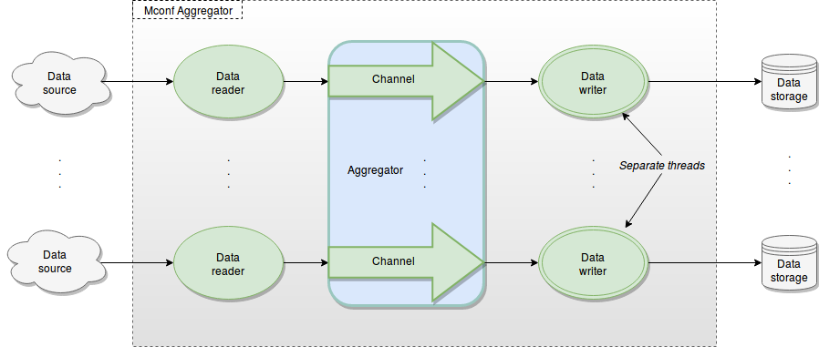

Architecture
************

The architecture of Mconf Aggregator with emphasis to the data flow is
shown below:

.. architecture:

    Overview of Mconf Aggregator architecture.

The data is firstly read/collected from the *data source* - an external data
provider - by the *data reader*. It can be done both actively or passively.
By actively we mean the *data reader* queries periodically the *data source*
for new data. Passively means the *data reader* just waits until new data arrive.
In both cases, the data flow from left to right.

The *data reader* then publishes the data to the channel. The Publisher (not
shown) is actually the responsible for queueing data onto the channel. Note that
**each data writer (callback) has its own channel (queue)**.

Once data is available, the *data writer* can pop it out from its channel and
process it. The common task here is to send the data to an external *data storage*.

Note that *data readers*, *aggregator* and *data writers* are components of the
Mconf-Aggregator. However it is flexible enough to easily extend to new readers
and writers (consult the API to see how).
